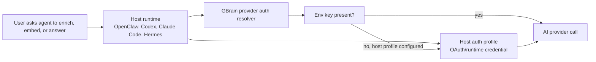

# Provider Auth Sources

GBrain can run provider calls from two credential sources:

- environment variables, such as `OPENAI_API_KEY` or `VOYAGE_API_KEY`;
- a host-managed OpenClaw auth profile, such as `openclaw-codex` or
  `openclaw-openai`.

Environment variables still win when present. The host profile is a secondary
source for users who already authenticated inside their agent host and do not
want every GBrain workflow to ask for another model API key.



Why this matters:

- host-authenticated users can reuse the credential path they already set up;
- provider setup remains explicit and inspectable with `gbrain providers`;
- secrets do not travel through tool payloads, PR logs, or JSON responses;
- non-OpenClaw users keep the normal env-based path.

Example config:

```json
{
  "ai": {
    "embedding_model": "openai:text-embedding-3-large",
    "provider_auth": {
      "openai": {
        "prefer": "openclaw-codex"
      }
    }
  }
}
```

For reviewers: this is a credential-source seam, not a new hosted auth system.
The resolver reports only the source class, expected credential key, profile
name, and readiness. It never returns the token value through status output.
